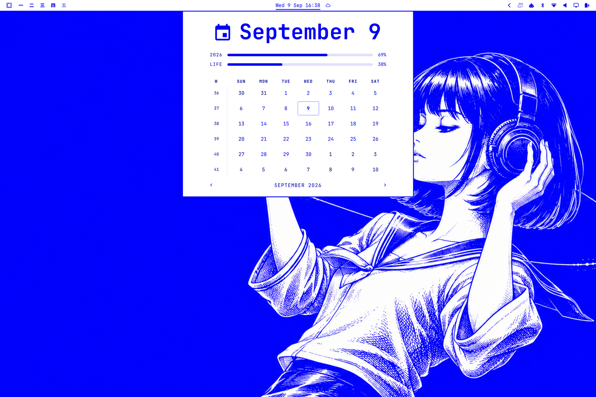
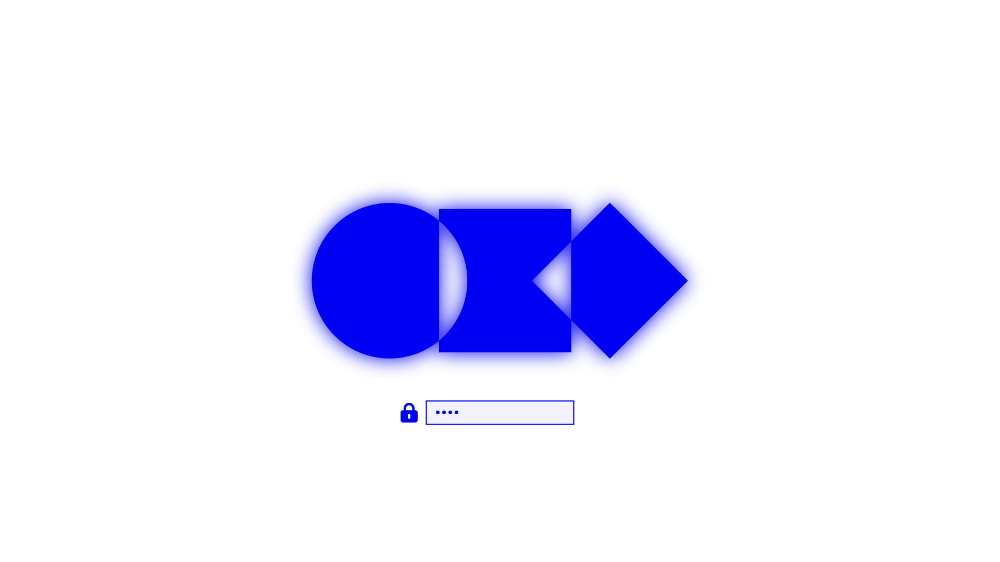

# Electric Blue

An [Omarchy](https://omarchy.org) theme in electric blue on white, inspired by the aesthetics of [Nous Research](https://nousresearch.com). Every colour is a tint of `#0000f2` over white, in the spirit of the stock White theme.



## Install

```bash
omarchy theme install https://github.com/t4t5/omarchy-electric-blue-theme
```

Or from the Omarchy menu: **Install → Style → Theme**, then paste the URL above.

## What's included

- `colors.toml` — a light-mode palette. Omarchy generates the terminal, bar, menus, notifications, lock screen, Neovim and app configs from it.
- `backgrounds/` — three 4K wallpapers. Cycle them with `omarchy theme bg next`.
- `unlock.png` — a matching unlock/boot logo, listed under **Style → Unlock**.
- `icons.theme` — pairs the theme with the Yaru-blue icon set.

## Unlock screen



## License

[MIT](LICENSE)
